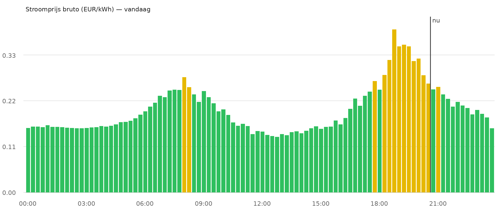
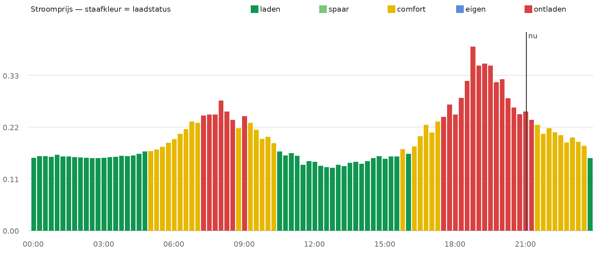

# ⚡ Energyprijs

**Eén service-call plant het complete dynamische-stroomprijs-package in Home Assistant.**

| Wat je krijgt | Details |
|---|---|
| 🔀 3 bronnen, kruiscontrole | Nord Pool · EnerPrice · EnergyZero — basisprijs faalt als <2 bronnen vers zijn |
| 📊 Bruto daglijst (15 min) | Direct grafiekklaar voor ApexCharts-card, vandaag + morgen |
| 💶 All-in formules | Afname/levering via instelbare velden: btw, energiebelasting, opslagen |
| 🔔 Meldingen | Automatisch bij bronuitval, spreiding of ontbrekende morgenprijzen |
| 🗓️ 2027-bestendig | Saldering vervalt 1-1-2027 → één schakelaar om, formules passen zichzelf aan |

## Installatie

### Stap 1 — HACS
1. **HACS → ⋮ → Custom repositories → Add repository**
   - Repository: `jouw-naam/energyprijs` (of de URL van deze repo)
   - Category: **Integration**
2. Zoek **Energyprijs** → **Download**
3. **Herstart Home Assistant**

### Stap 2 — Installeren
Developer Tools → Actions (Service):

```yaml
action: energyprijs.install
data: {}
```

De installer doet dan automatisch:

| # | Actie | Veiligheid |
|---|---|---|
| 1 | Package schrijven naar `/config/packages/energyprijs.yaml` | Overschrijft alleen dit bestand |
| 2 | `packages: !include_dir_named packages` toevoegen aan configuration.yaml | Alleen als afwezig; nooit dubbel |
| 3 | Melden dat herstart nodig is | Forceert niets — jij kiest het moment |

Optioneel: `force_restart: true` meesturen als je de herstart meteen wilt.

### Stap 3 — Controleren

```yaml
action: energyprijs.status
```

Toont of package + include aanwezig zijn.

## Voorwaarden

De package gebruikt sensoren van integraties die al geïnstalleerd moeten zijn:

- **Nord Pool** (core-integratie)
- **EnerPrice** (HACS: `LenFaki/home-assistant-nl-day-ahead-prices`) — zet *extended attributes* aan in de opties
- **EnergyZero** (core-integratie)
- Een notify-service genaamd `notify.home` (anders de naam in het package aanpassen)

## Entiteiten na installatie

```
sensor.prijzen_bron_nordpool          sensor.stroomprijs_basis
sensor.prijzen_bron_enerprice         sensor.stroomprijs_daglijst
sensor.prijzen_bron_energyzero        sensor.stroomprijs_afname
                                    sensor.stroomprijs_levering
binary_sensor.prijzen_kruiscontrole_afwijking
binary_sensor.prijzen_morgen_beschikbaar
input_number.prijs_btw / _energiebelasting / _opslag_afname / _opslag_levering / _afwijkingsdrempel / _laad_drempel
input_boolean.prijs_saldering_energiebelasting_teruggave
automation.prijzen_*  (2 meld-automatiseringen)
```

## Zo ziet je dashboard er daarna uit



*15-min staafjes van de bruto spotprijs; groen < €0,10 · lichtgroen < €0,25 · geel < €0,40 · rood ≥ €0,40. De gestippelde lijn is 'nu'. Dit is een nabouwing met echte data van vandaag — in HA tekent ApexCharts-card exact dit beeld, inclusief hover-waarden per kwartier.*

## Grafiek (optioneel)

Plak deze kaart in een dashboard (vereist `custom:apexcharts-card` via HACS):

```yaml
type: custom:apexcharts-card
section_mode: true
experimental:
  color_threshold: true
graph_span: 24h
span:
  start: day
update_interval: 5min
show:
  last_updated: true
now:
  show: true
  label: nu
header:
  show: true
  title: Stroomprijs — bruto · in · uit (EUR/kWh)
  show_states: true
  colorize_states: true
series:
  # ── kopwaarden 'NU' bovenin = actuele prijs (alleen header, niet getekend) ──
  - entity: sensor.stroomprijs_basis
    name: bruto nu
    float_precision: 3
    show:
      in_chart: false
  - entity: sensor.stroomprijs_afname
    name: in all-in
    float_precision: 3
    show:
      in_chart: false
  - entity: sensor.stroomprijs_levering
    name: uit all-in
    float_precision: 3
    show:
      in_chart: false
  # ── staafjes = bruto spot per kwartier, gekleurd op prijsniveau ──
  - entity: sensor.stroomprijs_daglijst
    name: bruto
    type: column
    data_generator: >
      return entity.attributes.vandaag.map((e) => [new Date(e.t).getTime() + 450000, e.p]);
    float_precision: 3
    color_threshold:
      - value: 0
        color: "#0a8f3c"
      - value: 0.1
        color: "#2fbf5f"
      - value: 0.25
        color: "#e6b800"
      - value: 0.4
        color: "#d94040"
    show:
      in_header: false
apex_config:
  xaxis:
    # as loopt een halve kolom verder dan de dag → eerste/laatste staafje volledig zichtbaar
    min: EVAL:new Date(new Date().setHours(0,0,0,0)).getTime() - 450000
    max: EVAL:new Date(new Date().setHours(23,59,59,999)).getTime() + 450000
yaxis:
  - decimals: 3
    # ~2 cent lucht boven de duurste en onder de goedkoopste prijs van vandaag
    min: '|+0.02|'
    max: '|+0.02|'
```

### Staafkleur = laadstatus

Wil je elk 15-min-blok zien als *beslissing* in plaats van als prijs? De daglijst bevat
per interval ook `s` (status), berekend tegen jouw drempel
(`input_number.prijs_laad_drempel`, standaard €0,337 — pas 'm aan via Settings →
Automatiseringen & Scenes → Helpers):

| Status | Betekenis | Kleur |
|---|---|---|
| laden | afname all-in ≤ drempel | 🟢 donkergroen |
| comfort | tot €0,08 boven drempel | 🟡 geel |
| ontladen | ver daarboven | 🔴 rood |

```yaml
type: custom:apexcharts-card
experimental:
  color_threshold: true
graph_span: 24h
span:
  start: day
now:
  show: true
  label: nu
series:
  - entity: sensor.stroomprijs_daglijst
    name: laden
    type: column
    color: "#109650"
    data_generator: >
      return entity.attributes.vandaag.filter(e => e.s === 'laden').map(e => [new Date(e.t).getTime(), e.p]);
  - entity: sensor.stroomprijs_daglijst
    name: comfort
    type: column
    color: "#e6b800"
    data_generator: >
      return entity.attributes.vandaag.filter(e => e.s === 'comfort').map(e => [new Date(e.t).getTime(), e.p]);
  - entity: sensor.stroomprijs_daglijst
    name: ontladen
    type: column
    color: "#d94040"
    data_generator: >
      return entity.attributes.vandaag.filter(e => e.s === 'ontladen').map(e => [new Date(e.t).getTime(), e.p]);
yaxis:
  - decimals: 3
```



Bij de **nu**-lijn tonen de kopwaarden bovenin automatisch de actuele prijzen:
bruto · **in** (afname all-in) · **uit** (levering all-in). Hover je over een staafje,
dan geeft de tooltip bruto/in/uit voor dat kwartier — want de daglijst-sensor bevat per
interval alle drie (`{t, p, in, uit}`). Wil je in/uit per interval in de grafiek zelf,
voeg dan deze twee lijn-series toe aan `series:` (met `show: {in_header: false}`):

```yaml
  - entity: sensor.stroomprijs_daglijst
    name: in
    type: line
    data_generator: >
      return entity.attributes.vandaag.map((e) => [new Date(e.t).getTime(), e.in]);
  - entity: sensor.stroomprijs_daglijst
    name: uit
    type: line
    data_generator: >
      return entity.attributes.vandaag.map((e) => [new Date(e.t).getTime(), e.uit]);
```

## Werking & ontwerp

- **Rekenen nooit met onverse data:** elke bron heeft een beschikbaarheidsvlag; de basisprijs vereist ≥2 verse bronnen, anders unavailable + notificatie.
- **Bruto is de basis** (kale markt excl. belasting/btw) — geschikt voor arbitrage en grafiek; all-in zit in aparte sensoren.
- **Helpers in UI aanpasbaar** — contractwijziging volgend jaar? Alleen input-velden verzetten, geen YAML-edits.

## Verwijderen

Map `custom_components/energyprijs` verwijderen + het package-bestand uit `/config/packages/` halen + herstart. De installer liet verder niets achter in configuration.yaml behalve de (optioneel te laten staan) packages-include.

## Versiehistorie

| Versie | Wijziging |
|---|---|
| 1.0.1 | Fixes uit HA-test: `min/max/initial`, mode `restart`, Jinja zonder zip-filter, availability-patroon |
| 1.0.0 | Eerste versie: installer + package |